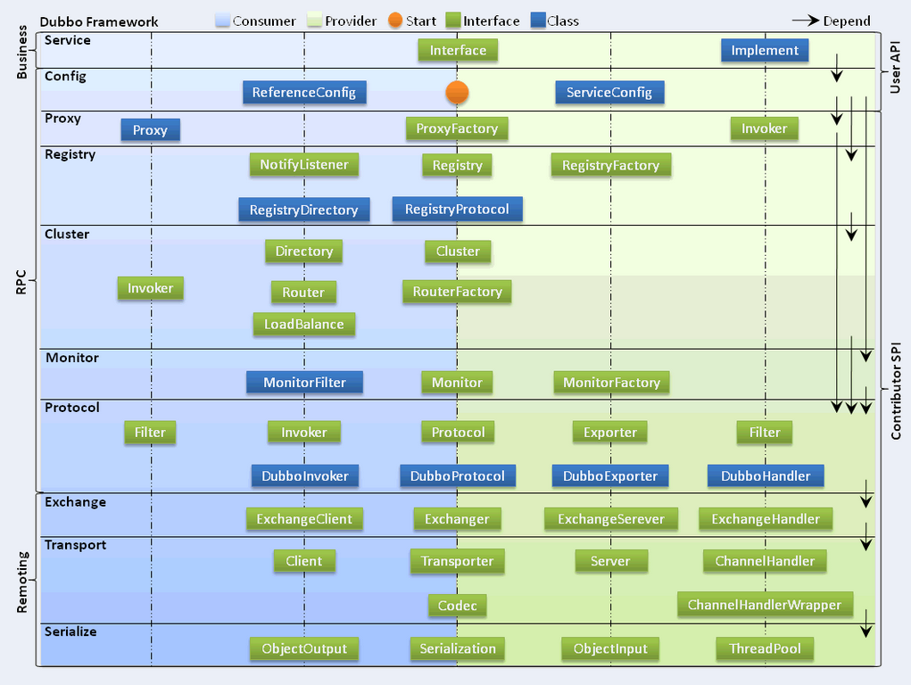

# My-RPC-Dubbo-Chen
基于RPC框架的简单Dubbo实现，还有很多功能没有实现，Dubbo实在太强大！

前段时间学习了Netty，学完以后最后尝试做了个简单的RPC实现（github上的另一个项目）。

最近学了分布式相关内容，见识到Dubbo的强大，尝试基于Netty实现Dubbo的功能
目前只实现了 RPC 框架最基本的功能，一些可优化点都在下面提到了。


## 介绍

本项目是基于 Netty+Kyro+Zookeeper 实现的 RPC 框架。网络传输实现了基于 Java 的 Netty 版本，并且实现了多种序列化与负载均衡算法。


**我们先从一个基本的 RPC 框架设计思路说起！**

### 一个基本的 RPC 框架设计思路

> **注意** ：RPC 框架指的是：可以让客户端直接调用服务端方法就像调用本地方法一样简单的框架

一个最简单的 RPC 框架使用示意图如下图所示 ：


服务提供端 Server 向注册中心注册服务，服务消费者 Client 通过注册中心拿到服务相关信息，然后再通过网络请求服务提供端 Server。

作为 RPC 框架领域的佼佼者[Dubbo](https://github.com/apache/dubbo)的架构如下图所示,和我们上面画的大体也是差不多的。




**一般情况下， RPC 框架不仅要提供服务发现功能，还要提供负载均衡、容错等功能，这样的 RPC 框架才算真正合格的。**

**简单说一下设计一个最基本的 RPC 框架的思路：**


1. **注册中心** ：注册中心首先是要有的，推荐使用 Zookeeper。注册中心负责服务地址的注册与查找，相当于目录服务。服务端启动的时候将服务名称及其对应的地址(ip+port)注册到注册中心，服务消费端根据服务名称找到对应的服务地址。有了服务地址之后，服务消费端就可以通过网络请求服务端了。
2. **网络传输** ：既然要调用远程的方法就要发请求，请求中至少要包含你调用的类名、方法名以及相关参数吧！推荐基于 NIO 的 Netty 框架。
3. **序列化** ：既然涉及到网络传输就一定涉及到序列化，你不可能直接使用 JDK 自带的序列化吧！JDK 自带的序列化效率低并且有安全漏洞。 所以，你还要考虑使用哪种序列化协议，比较常用的有 hession2、kyro、protostuff。
4. **动态代理** ： 另外，动态代理也是需要的。因为 RPC 的主要目的就是让我们调用远程方法像调用本地方法一样简单，使用动态代理可以屏蔽远程方法调用的细节比如网络传输。也就是说当你调用远程方法的时候，实际会通过代理对象来传输网络请求，不然的话，怎么可能直接就调用到远程方法呢？
5. **负载均衡** ：负载均衡也是需要的。为啥？举个例子我们的系统中的某个服务的访问量特别大，我们将这个服务部署在了多台服务器上，当客户端发起请求的时候，多台服务器都可以处理这个请求。那么，如何正确选择处理该请求的服务器就很关键。假如，你就要一台服务器来处理该服务的请求，那该服务部署在多台服务器的意义就不复存在了。负载均衡就是为了避免单个服务器响应同一请求，容易造成服务器宕机、崩溃等问题，我们从负载均衡的这四个字就能明显感受到它的意义。
6. ......

### 项目模块概览
- **roc-api**	——	通用接口
- **rpc-common**	——	实体对象、工具类等公用类
- **rpc-core**	——	框架的核心实现
- **rpc-client**	——	消费端
- **rpc-server**	——	服务提供端
- **test-client**	——	测试用消费侧
- **test-server**	——	测试用提供侧

### 项目基本情况和可优化点

完成的部分及可优化点列在下面 👇。


- [x] **使用 Netty（基于 NIO）替代 BIO 实现网络传输；**
- [x] **实现了四种序列化算法，Json 方式、Kryo 算法、Hessian 算法与 Google Protobuf 方式（默认采用 Kryo方式序列化）；**
- [x] **使用 Zookeeper 管理相关服务地址信息**
- [x] **Netty 重用 Channel 避免重复连接服务端**
- [x] **使用 `CompletableFuture` 包装接受客户端返回结果（之前的实现是通过 `AttributeMap` 绑定到 Channel 上实现的） 详见：[使用 CompletableFuture 优化接受服务提供端返回结果](./docs/使用CompletableFuture优化接受服务提供端返回结果.md)**
- [x] **增加 Netty 心跳机制** : 保证客户端和服务端的连接不被断掉，避免重连。
- [x] **客户端调用远程服务的时候进行负载均衡，实现了两种负载均衡算法：随机算法与轮转算法** ：

- [x] **服务提供侧自动注册服务，使用注解进行服务消费**
- [x] **实现自定义的通信协议** 可以将原有的 `RpcRequest`和 `RpcReuqest` 对象作为消息体：
  - **魔数** ： 通常是 4 个字节。这个魔数主要是为了筛选来到服务端的数据包，有了这个魔数之后，服务端首先取出前面四个字节进行比对，能够在第一时间识别出这个数据包并非是遵循自定义协议的，也就是无效数据包，为了安全考虑可以直接关闭连接以节省资源。
  - **序列化器编号** ：标识序列化的方式，比如是使用 Java 自带的序列化，还是 json，kyro 等序列化方式。
  - **消息体长度** ： 运行时计算出来。
  - ......

可优化部分：
- [ ] **容错机制**
- [ ] **SPI**


## 传输协议

调用参数与返回值的传输采用了如下 协议以防止粘包：

```
+---------------+---------------+-----------------+-------------+
|  Magic Number |  Package Type | Serializer Type | Data Length |
|    4 bytes    |    4 bytes    |     4 bytes     |   4 bytes   |
+---------------+---------------+-----------------+-------------+
|                          Data Bytes                           |
|                   Length: ${Data Length}                      |
+---------------------------------------------------------------+
```

| 字段            | 解释                                                         |
| :-------------- | :----------------------------------------------------------- |
| Magic Number    | 魔数，表识一个 MRF 协议包，0xCAFEBABE                        |
| Package Type    | 包类型，标明这是一个调用请求还是调用响应                     |
| Serializer Type | 序列化器类型，标明这个包的数据的序列化方式                   |
| Data Length     | 数据字节的长度                                               |
| Data Bytes      | 传输的对象，通常是一个`RpcRequest`或`RpcClient`对象，取决于`Package Type`字段，对象的序列化方式取决于`Serializer Type`字段。 |


## 注册中心

使用Zookeeper实现


//TODO